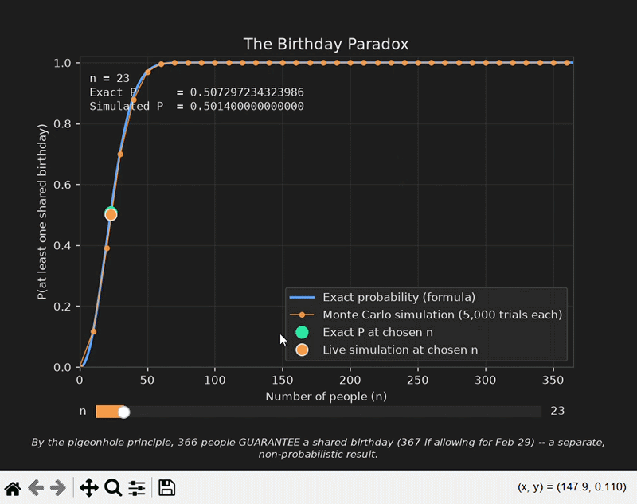

# Birthday Paradox Simulator

An interactive visualizer comparing the exact probability of a shared
birthday among $n$ people against a live Monte Carlo simulation, with a
slider to explore any group size from 0 to 365.

- **Exact probability** — computed directly from the closed-form formula
- **Monte Carlo simulation** — thousands of randomized trials per point,
  re-run live whenever the slider moves

## Output



*Dragging the slider to n = 23 shows the exact probability (≈50.7%) and a
live Monte Carlo estimate (≈50.1%) converge closely — the classic "23
people" threshold where a shared birthday becomes more likely than not.*

## Features

- Exact-formula curve and a pre-computed Monte Carlo curve plotted together
  across the full range of $n$
- A slider to pick any $n$, which redraws both an exact marker and a
  freshly-simulated marker on the curves and prints both probabilities to
  full precision
- Dark theme UI
- Cross-platform window centering (Tk, Qt, and Wx backends)

## Requirements

- Python 3.9+
- See `requirements.txt`

## Setup

```bash
pip install -r requirements.txt
```

## Usage

```bash
python MonteCarlo.py
```

Drag the **n** slider to any group size and watch the exact and simulated
probabilities update live.

## Math

For $n$ people and $d$ equally likely birthdays ($d = 365$ here, ignoring
leap years), the probability that **no** two people share a birthday is:

$$
P(\text{no match}) = \prod_{i=0}^{n-1} \frac{d - i}{d}
$$

so the probability that **at least one** pair shares a birthday is:

$$
P(\text{match}) = 1 - \prod_{i=0}^{n-1} \frac{d - i}{d}
$$

The Monte Carlo estimate draws `trials` random groups of $n$ birthdays each
(uniformly from $d$ possible days) and reports the fraction of those trials
that contain at least one repeated day.

Separately, by the pigeonhole principle, $d+1$ people (366, or 367 allowing
for Feb 29) are **guaranteed** to share a birthday — a distinct,
non-probabilistic result from the one plotted here.

## License

MIT — see [LICENSE](LICENSE).